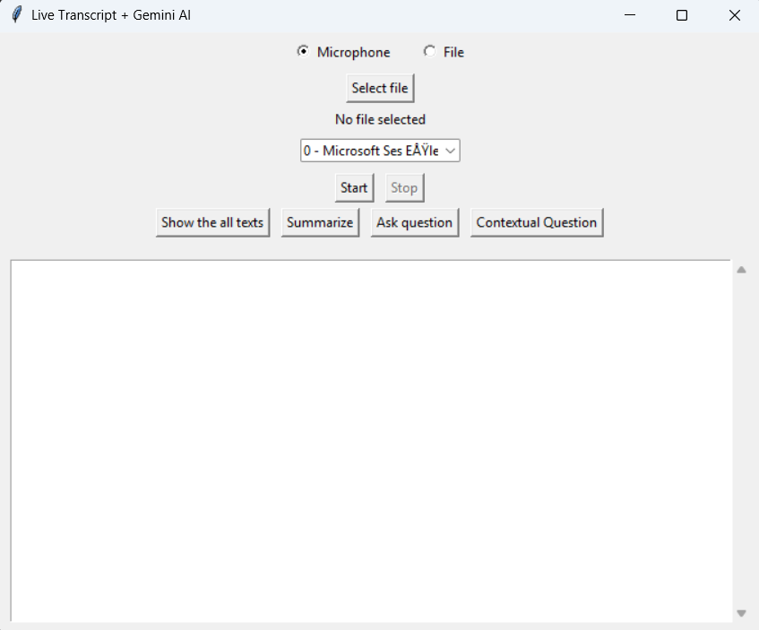

# Speech to Text Application

This is a real-time speech-to-text transcription application with AI capabilities. The application uses the Whisper model for transcription and integrates with Gemini AI for advanced text analysis.

## Features

- 🎙️ Real-time speech-to-text transcription
- 📁 Audio file transcription support
- 🔊 Multiple audio input device support
- 🤖 AI-powered text analysis using Gemini AI
- 📝 Text embedding and semantic search capabilities
- 🔍 Question-answering about transcribed content
- 🌐 Support for both English and Turkish languages
- 💾 Automatically saves all transcribed text and summarized text in .txt format after each conversation is stopped

## Requirements

- Python 3.8+
- PyAudio
- faster-whisper
- webrtcvad
- numpy
- scikit-learn
- tkinter
- requests

## Configuration

The application's configuration can be found in `config.py`:

```python
- API_KEY: Your Gemini AI API key
- RATE: Audio sampling rate (default: 16000)
- CHANNELS: Audio channels (default: 1)
- CHUNK: Audio chunk size (default: 1024)
- DURATION: Recording duration in seconds (default: 8)
- FILE_BEAM_SIZE: Beam size for file transcription (default: 1)
- AUDIO_BEAM_SIZE: Beam size for live audio transcription (default: 3)
- MODEL_SIZE: Whisper model size, choose from `ModelSize` enum:
    - ModelSize.TINY
    - ModelSize.SMALL
    - ModelSize.BASE
- EMBEDDING_MODEL: Path to embedding model (default: "models/gemini-embedding-001")
- CONTENT_GEN_MODEL: Path to content generation model (default: "models/gemini-2.0-flash")
- DEVICE: Processing device, choose from `DeviceType` enum:
    - DeviceType.CPU
    - DeviceType.CUDA
- COMPUTE_TYPE: Model compute type, choose from `ComputeType` enum:
    - ComputeType.INT8
    - ComputeType.FLOAT16
```
- Notes: You can change your performance or accuracy gain functions as you want by changing the property in the configuration file.

## Demo / Screenshots

|  |  |  |
|--------------------------------|--------------------------------|--------------------------------|
|  |  |  |

## Usage

1. Launch the application:
```bash
python main.py
```

2. Select your input source:
   - Microphone: Choose your input device from the dropdown
   - File: Select an audio file to transcribe

3. Use the interface buttons:
   - 🎙️ **Start**: Begin recording/transcribing  
     > *For microphone input: begin recording and live transcription.*  
     > *For audio files: start transcribing the selected file. The transcription will automatically stop when the file ends, or you can stop it manually.*
   - 🛑 **Stop**: Stop the current session
   - 📜 **Show All Text**: View complete transcript
   - ❓ **Ask Questions**: Query the transcribed content


## Project Structure

```
speechToTextApp/
├── config.py         # Configuration settings
├── main.py          # Main application code
├── arrays.py        # Shared data structures
└── image/
    └── ss.png       # Application screenshots
```

## Technical Details

- Uses WebRTC VAD (Voice Activity Detection) for better speech detection
- Implements threading for non-blocking audio processing
- Employs queue system for audio data management
- Utilizes Whisper model for accurate speech recognition
- Integrates with Gemini AI for advanced text processing
- Implements text embedding for semantic search capabilities
